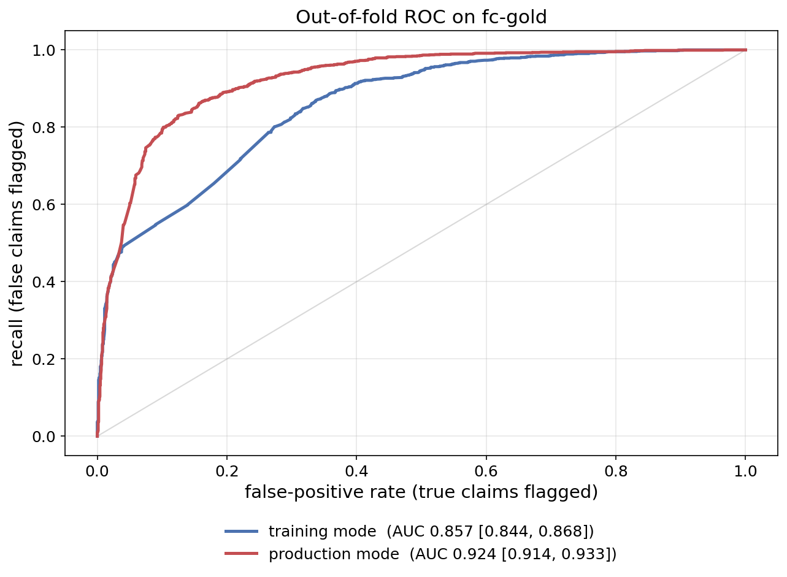
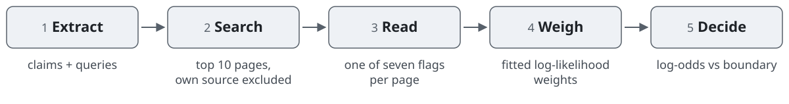
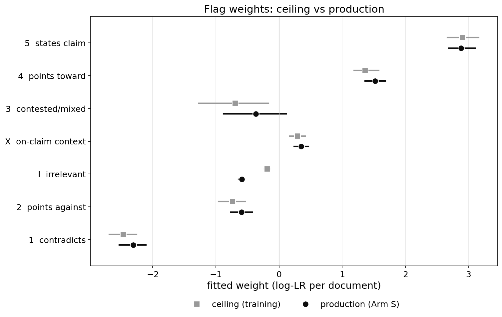
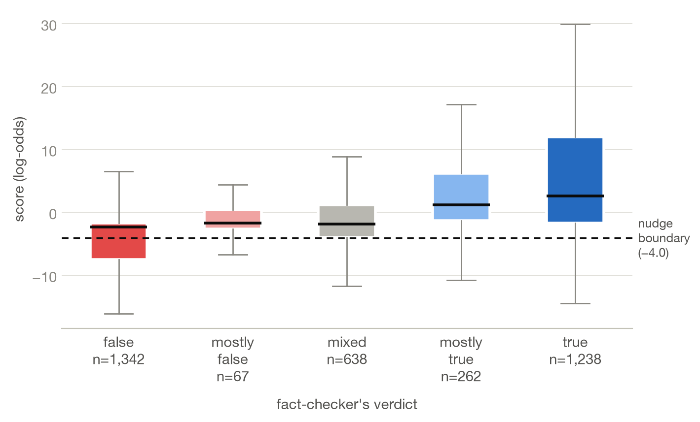
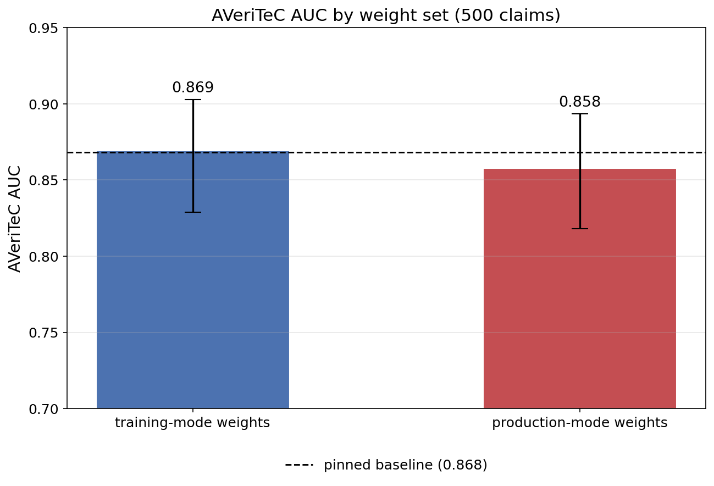
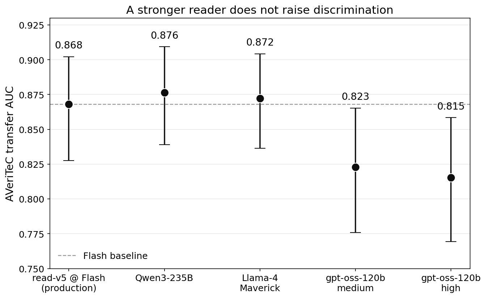
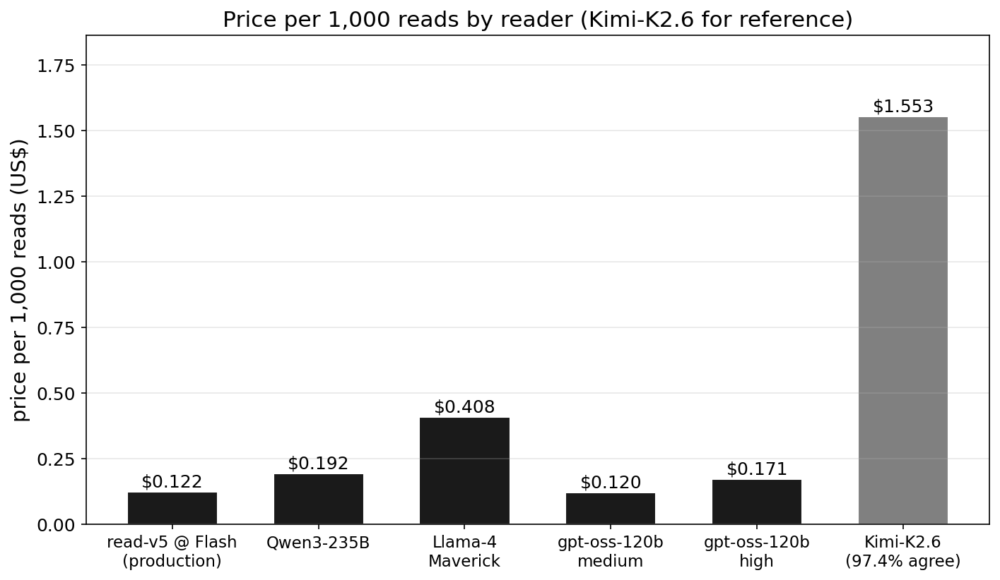
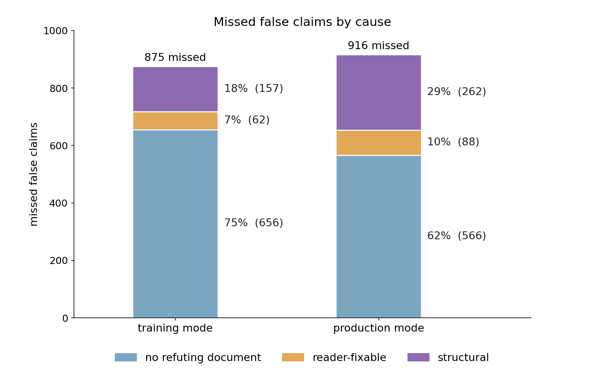

<h1 align="center">TruthOdds</h1>

<b>A calibrated, interpretable, near-free fact-checker for social posts.</b>

  

Most claims people share online are never checked, and professional fact-checkers reach a tiny fraction of them. TruthOdds asks whether a cheap language model, pointed at the open web, can produce a trustworthy estimate of a claim's odds of being true, fast enough and cheaply enough to run on every post before it is shared. It extracts a post's claims, searches for each one, has a small model read the top results and flag each page (states the claim, supports it, contradicts it, and so on), then combines the flags with weights fitted on 3,000 claims drawn from 83,000 professional fact-checks into a single log-odds score. The result is a number you can read, a per-page account of where it came from, and a decision boundary set for a 2% false-positive rate. It was built at Sciences Po as the instrument behind a study of how warnings change what people share.

Telling true claims from false ones on 3,000 professionally fact-checked claims. The stricter curve only lets the reader see pages published before the fact-check existed; the other lets it see today's web.

## How it works

<picture><source media="(prefers-color-scheme: dark)" srcset="docs/figures/pipeline-dark.svg"></picture>

1. **Extract.** A language model pulls the checkable claims out of a post and writes one web search query per claim.
2. **Search.** The top ten results come back, with the claim's own source excluded so a post cannot vouch for itself.
3. **Read.** A small, cheap model reads each page and assigns one of seven flags, from *states the claim as fact* to *contradicts the claim*.
4. **Weigh.** Each flag carries a weight fitted on professional fact-checks: how much more likely that flag is under a true claim than a false one. The weights simply add up.
5. **Decide.** The sum is a log-odds score. Below a boundary set for a 2% false-positive rate, the post gets a nudge before it is shared.

The whole model is these seven numbers. A page that contradicts a claim pulls the score down; a page that states it as fact pushes it up. Nothing is hidden inside a network.

## One claim, end to end

A PolitiFact fact-check from 2022, rated false:

> North Korea confirms it has landed a man on the sun.

The search query is `North Korea man on the sun claim`, limited to pages dated before the fact-check was published. The top ten results, and what the reader made of each:

| # | Page | Headline | Flag | Weight |
|--:|---|---|---|--:|
| 1 | waterfordwhispersnews.com | North Korea Lands First Ever Man On The Sun (satire, 2014) | states the claim as fact | +2.90 |
| 2 | mic.com | Did North Korea Really Claim to Land a Man On the Sun? | contradicts the claim | −2.46 |
| 3 | ktar.com | Report of North Korea landing man on sun goes viral | contradicts the claim | −2.46 |
| 4 | tweaktown.com | North Korea confirms it has landed a man on the sun | contradicts the claim | −2.46 |
| 5 | imediaethics.org | Hoax: North Korea didn't send 17-year-old astronaut to the sun | contradicts the claim | −2.46 |
| 6 | techeblog.com | North Korea claims to have landed on the sun, hilarity ensues | irrelevant | −0.19 |
| 7 | indiatoday.in | North Korean becomes 'first man to land on Sun' in hoax news | contradicts the claim | −2.46 |
| 8 | hrnkinsider.org | The true identity of the North Korean dictator | irrelevant | −0.19 |
| 9 | jstor.org | (journal article) | irrelevant | −0.19 |
| 10 | dia.mil | North Korea Military Power | irrelevant | −0.19 |
| | | | **score** | **−10.17** |

The score of −10.17 is below the boundary of −4.01, so the post gets a nudge. One satirical page states the claim as fact; five pages that debunk it outweigh it.

For contrast, a true Snopes claim from 2024, "Kiribati is the only country in the world to touch all four hemispheres", finds eight pages that state it, one that points toward it and one irrelevant page, and scores +24.39. It passes.

Every score comes with this table. When the system is wrong, you can see which page misled it.

## Does it hold up

Scores by the fact-checker's verdict. The dashed line is the nudge boundary.

On AVeriTeC, a benchmark the weights never saw, the same seven weights reach an AUC of 0.869.

## The cheapest reader is as good as the best

 

Swapping the small reader for models ten times larger changes nothing: on the same 500 claims, DeepSeek Flash reaches 0.858, DeepSeek Pro 0.851, Kimi K2.6 0.848. What changes is the bill: about $0.12 per thousand pages read against $1.55. Scoring 1,660 claims, more than 16,000 page reads, cost about $2.

## Where it fails, and why that matters

When a false claim slips through, it is rarely because the reader misjudged a page. In 44% of false claims, no page anywhere in the top results refutes them; nobody has written the correction yet. Three quarters of misses trace back to retrieval. The ceiling is set by the web, not by the model, which is also why a bigger model does not help.

## Scope and ethics

- Fact-check corpora and the AVeriTeC benchmark are used under their own terms and are not redistributed here. Only aggregate metrics and figures are in the repo.
- No proprietary source-rating data is included.
- The system reads public web pages and never posts, replies, or acts on anyone's behalf.
- This is research software. Scores are estimates with stated error rates, not verdicts.

## Read the code

- [Code walkthrough](https://danieldager.github.io/truthodds/code_walkthrough.html), a guided tour of the pipeline, stage by stage.
- [Final instrument report](https://danieldager.github.io/truthodds/final_instrument.html), the frozen evaluation behind the numbers above.
- `src/` holds the pipeline; `capture/` holds a browser extension that collects posts for study.

## Status

A research snapshot from a live project at Sciences Po, Department of Economics. A browser extension that scores posts before sharing is in progress, and a paper with collaborators is forthcoming. Issues and questions are welcome.
